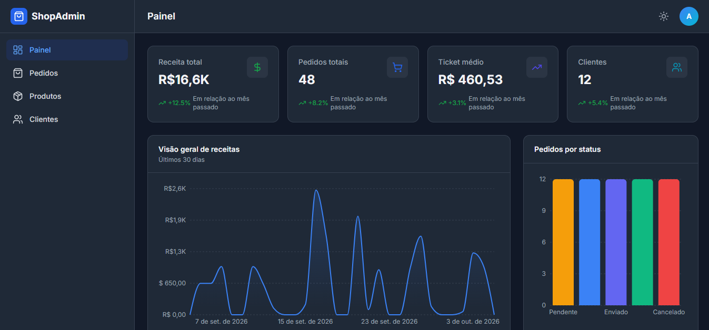
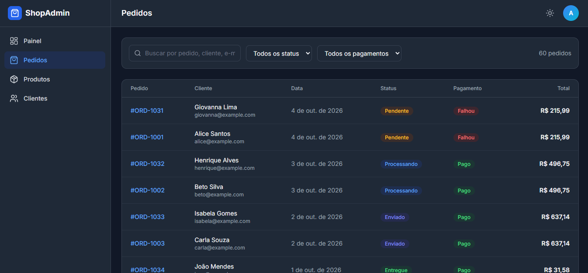
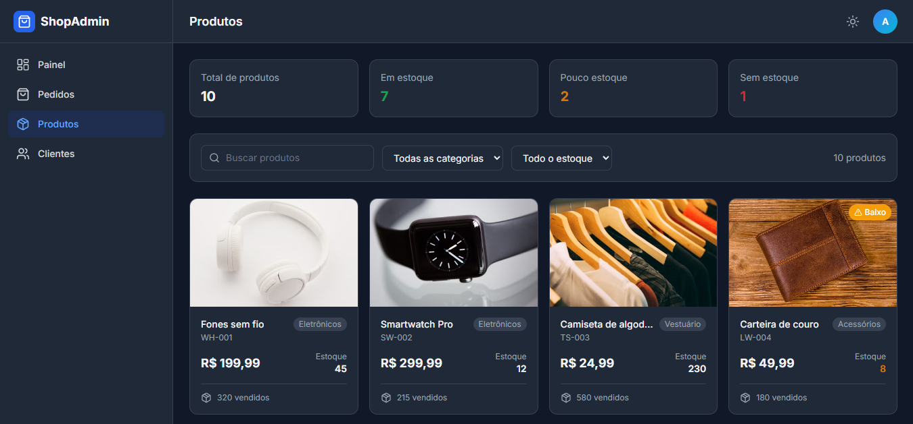
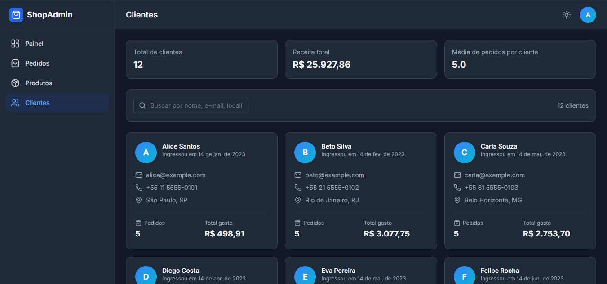

# 📈ShopAdmin

ShopAdmin é um painel administrativo para acompanhar as principais informações de uma loja virtual. A interface reúne indicadores de vendas, pedidos, produtos e clientes em uma experiência responsiva, com suporte a tema claro e escuro.

## ✨Funcionalidades

- **Painel:** indicadores de receita, pedidos, ticket médio e clientes, gráficos, produtos mais vendidos e alertas de estoque.
- **Pedidos:** busca, filtros por status do pedido e pagamento, paginação e visualização dos detalhes e do progresso de cada pedido.
- **Produtos:** catálogo com busca e filtros por categoria e nível de estoque.
- **Clientes:** busca por nome, e-mail ou localização e resumo dos pedidos e valores gastos.
- **Interface:** navegação entre páginas, alternância entre temas claro e escuro e layout responsivo.

> Os dados exibidos são simulados e definidos localmente; o projeto ainda não está conectado a um serviço externo.

## 🖥️Tecnologias

- React 18 e TypeScript
- Vite
- Tailwind CSS
- TanStack Router
- Recharts
- Lucide React

## 🏗️Arquitetura

A aplicação é um frontend organizado por responsabilidade: `src/pages` contém as páginas, `src/components` reúne componentes de interface, layout e gráficos, e `src/data/mockData.ts` fornece os dados simulados usados pela aplicação. Os tipos e funções auxiliares ficam em `src/types` e `src/lib`. A navegação é configurada em `src/router.tsx`.

## 📸Capturas de tela

### Painel




### Pedidos 



### Produtos



### Clientes 



## ⚙️Como executar

Requisitos: Node.js e npm instalados.

Na pasta do projeto, instale as dependências e inicie o servidor de desenvolvimento:

```bash
npm install
npm run dev
```

Abra no navegador o endereço local informado pelo Vite no terminal. Para verificar o projeto e gerar a versão de produção, use:

```bash
npm run typecheck
npm run lint
npm run build
```

Futuramente, o projeto terá uma parte de backend/API para fornecer e gerenciar os dados da aplicação, substituindo os dados simulados utilizados atualmente.
